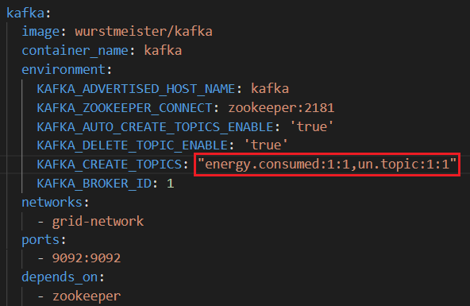

# Smartrix Grid - F 
Projet Smartrix Grid du cours "Service Oriented Architecture".


## Membres

- Dina Abakkali 
- Sylvain Marsili 
- Thomas Martin
- Clement Poueyto
- Florian Striebel


## Technologies

[MongoDB](https://www.mongodb.com/)  
[NestJs](https://nestjs.com/)  
[Docker](https://www.docker.com/)  


## Lancer l'application

```bash

$ git clone git@github.com:pns-si5-soa/smartrix-21-22-soa-21-22-f.git

$ cd smartrix-21-22-soa-21-22-f

$ git checkout tags/delivery-first

$ ./prepare.sh

$ ./run.sh

```

## Demonstration 

Les scénarios peuvent être trouvés dans le rapport -> [ici](./reports/report.pdf)

Les couleurs des logs :
- violet -> indique le scénario en cours
- jaune -> affiche la description de l'étape en cours
- bleu -> affiche les requêtes effectuées
- blanc -> affiche les retours de requête

## Aide Bus

Afin d'utiliser [Kafka avec nestjs](https://docs.nestjs.com/microservices/kafka), télécharger kafkajs.
```bash
$ npm i --save kafkajs
```
Le serveur Kafka (ainsi que zookeeper) tourne dans un container docker, et est intégré dans l'application grâce à [docker-compose](./docker-compose.yml).

### Topic

Les événements envoyés sur le bus sont organisés et stockés dans des topics. Ces derniers représentent des channels/catégories d'événements.
Par exemple le topic *"energy.consumed"* où est envoyé les consommations éléctriques des différentes maisons de la grid. 

Afin de créer un nouveau topic, il faut tout d'abord l'ajouter dans la configuration docker de kafka.



*"un.topic:1:1"*: le topic à pour nom *"un.topic"*, avec 1 partition et 1 replica.

### Consumer

 Afin d'écouter les évènements d'un topic, il faut un consommateur qui écoute ce dernier.

 Après avoir créé une app nest, il faut alors modifier le fichier **main.ts** pour configurer le consommateur.
 ```ts
 import { NestFactory } from '@nestjs/core';
import { MicroserviceOptions, Transport } from '@nestjs/microservices';
import { ConsumptionViewerModule } from './consumption-viewermodule';

async function bootstrap() {
  const app = await NestFactory.create(ConsumptionViewerModule);
  const microservicekafka  = app.connectMicroservice<MicroserviceOptions>({
    transport: Transport.KAFKA,
    options: {
      client: {
        clientId: 'consumption-viewer',
        brokers: ['kafka:9092'],
      },
      consumer: {
        groupId: 'consumption-viewer-consumer'
      }
    }
  });
  await app.startAllMicroservices();
  await app.listen(3000);
}
bootstrap();

 ```

 Il faut notamment créer et connecter un microservice avec *connectMicroservice* configurer avec le mode de transport *kafka*. 

Les options:
<ul>
<li><b>clientId</b>: l'id du service </li>
<li><b>brokers</b>: permet de liée le service aux différents brokers via leur url</li>
<li><b>groupId</b>: l'id du groupe auquel appartient le consommateur,<a href="https://sagarkudu.medium.com/explain-consumer-group-in-kafka-1c61fa3a77b" title="Hobbit lifestyles"> explication ici</a>
. Dans notre cas il faut qu'il soit unique pour chaque consommateur</li>
</ul

Une fois configuré, le consommateur doit alors écouter le topic afin de récuperer les différents évènements qui y transitent. Pour cela il faut rajouter dans le **controller.ts** de l'application le décorateur *@MessagePattern('un.topic')* sur la méthode de son choix. Puis rajouter le décorateur @Payload() en paramètre de la méthode pour récuperer le contenu du message.
 ```ts
  @MessagePattern('energy.consumed')
  async energyConsumed(@Payload() message) {
    var consumption = new ConsumptionDto(message.value,message.timestamp);
    await this.consumptionViewerService.create(consumption);
  }
 ```

### Producer

Pour configurer le producteur d'évènements, c'est le fichier *module.ts* que l'on modifie presque de la même manière que pour le consommateur, mais grâce à la méthode *register* de *ClientsModule*.
 ```ts

import { Module } from '@nestjs/common';
import { ClientsModule, Transport } from '@nestjs/microservices';
import { HouseController } from './house.controller';
import { HouseService } from './house.service';

@Module({
  imports: [ ClientsModule.register([
    {
      name: 'HOUSE_SERVICE',
      transport: Transport.KAFKA,
      options: {
        client: {
          clientId: 'house',
          brokers: ['kafka:9092'],
        },
        consumer: {
          groupId: 'house-consumer'
        }
      }
    },
  ]),],
  controllers: [HouseController],
  providers: [HouseService],
})
export class HouseModule {}
```
Ensuite, afin d'envoyer les évènements, il faut injecter dans le **controller.ts** de l'application le *ClientKafka* avec le nom du service producteur.
```ts
constructor(@Inject('HOUSE_SERVICE')  private readonly client: ClientKafka,
  private readonly houseService: HouseService,) {  }
```
 Ce client va alors permettre d'émettre des évènements sur le topic de son choix.
 ```ts
   energyConsumed() {
    // ...
     this.client.emit('energy.consumed', JSON.stringify(consumption)); 
   }
 ```

 On peut remarquer que le producteur lors de sa configuration, à lui aussi dans ses options un consumer. En effet les consommateurs peuvent, une fois un évènement capté, renvoyé une réponse au producteur. Le producteur est alors consommateur de ces réponses.Par example un consommateur qui écoute les évènements envoyés sur le topic *"un.topic"* peut renvoyer (en NestJs) une réponse sur le topic *"un.topic.reply"* que le produteur écoutera.

 Pour cela le **controller.ts** du producteur doit implementer *OnModuleInit*. Les méthodes *subscribeToResponseOf('un.topic')* et *client.connect()* permettent donc de s'abonner aux réponses des évènements envoyés sur le topic *"un.topic"* en envoyant ces réponses sur le topic *"un.topic.reply"*

 Mais afin d'accepter de recevoir une réponse d'un évènement, le producteur doit envoyer ses évènements avec la fonction  *send()* et pas la fonction *emit()*.

```ts
@Controller()
export class HouseController implements OnModuleInit{
constructor(@Inject('HOUSE_SERVICE')  private readonly client: ClientKafka,
  private readonly houseService: HouseService,) {  }

  async onModuleInit() {
    this.client.subscribeToResponseOf('un.topic');// un.topic.reply
    await this.client.connect();
  }
 @Get('envoieAvecReponse')
  envoieAvecReponse(){
    return this.client.send('un.topic', {data: "une donnée"})
```

Exemple de mise en place de bus kafka en NestJs:
[site 1](https://dev.to/kannndev/kafka-nest-js-248) et 
[site 2](https://javascript.plainenglish.io/a-beginners-introduction-to-kafka-with-typescript-using-nestjs-7c92fe78f638)

## Répartition des points dans l'équipe
- Sylvain Marsilli : 100
- Thomas Martin : 100
- Clément Poueyto: 100
- Dina Abakkali : 100
- Sylvain Marsili : 100


### La démo 
Les couleurs des logs :
- violet -> indique le scénario en cours
- jaune -> affiche la description de l'étape en cours
- bleu -> affiche les requêtes effectuées
- blanc -> affiche les retours de requête